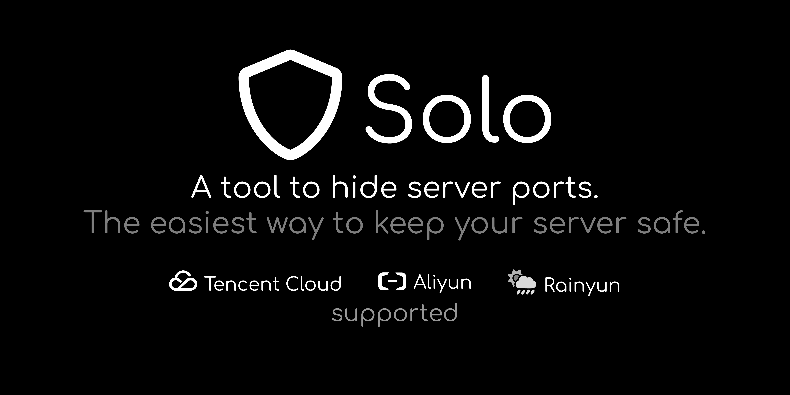

# Solo

[简体中文](README.md) | **English**

A cloud server port hiding tool

## Features

- **Design for Cloud Servers**: Supports mainstream cloud providers
- **Protect Important Port**: SSH, remote desktop, panels and other critical services
- **Private Access**: Ports are only accessible to you, avoiding malicious scanning

## Quick Start

Protect your server in just three steps:

1. **Install Solo** - Install Solo on your personal device
2. **Configure Service** - Configure according to the [documentation](https://solo.lance.fun/)
3. **Run Protection** - Start Solo (supports auto-start and scheduled running)

## Usage Guide

- [Complete Documentation](https://solo.lance.fun/)
- [Download Page](https://solo.lance.fun/download/)

## Supported Cloud Providers

|   Provider    |                      Products                      |
| :-----------: | :------------------------------------------------: |
| Tencent Cloud |         Cloud Virtual Machine, Lighthouse          |
|    Aliyun     | Elastic Compute Service, Simple Application Server |
|    Rainyun    |                 Cloud Server                       |

## Contributing

Solo is under continuous development and welcomes your participation:

- **Report Issues**: [Github Issues](https://github.com/cnlancehu/solo/issues/new) | [Gitee Issues](https://gitee.com/lancehu/solo/issues/new)
- **Code Contribution**: [Submit Pull Request](https://github.com/cnlancehu/solo)
- **Documentation Improvement**: [Improve Documentation](https://github.com/cnlancehu/solo-doc)
