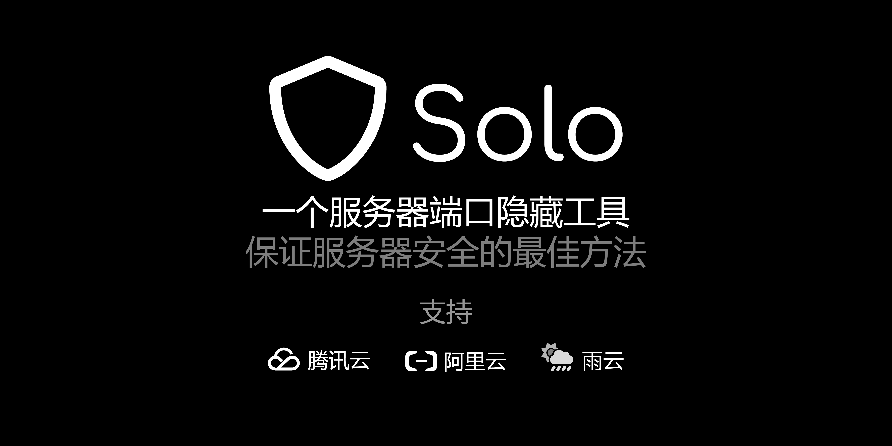

# Solo

**简体中文** | [English](README-en.md)

一个云服务器端口隐藏工具

## 功能特性

- **为云服务器设计**：支持主流云服务商
- **保护重要端口**：SSH、远程桌面、面板等关键服务
- **私人访问**：端口仅对你开放，避免恶意扫描

## 快速开始

只需三步，轻松保护你的服务器：

1. **安装 Solo** - 在你的个人设备上安装 Solo
2. **配置服务** - 按照 [使用文档](https://solo.lance.fun/zh/) 进行配置
3. **运行保护** - 启动 Solo（支持开机自启和定时运行）

## 使用指南

- [完整文档](https://solo.lance.fun/zh/)
- [下载页面](https://solo.lance.fun/zh/download/)

## 支持的云服务商

| 服务商 |         支持产品         |
| :----: | :----------------------: |
| 腾讯云 | 云服务器、轻量应用服务器 |
| 阿里云 | 云服务器、轻量应用服务器 |
|  雨云  |         云服务器         |

## 参与贡献

Solo 正在持续开发中，欢迎你的参与：

- **反馈问题**：[Github Issues](https://github.com/cnlancehu/solo/issues/new) | [Gitee Issues](https://gitee.com/lancehu/solo/issues/new)
- **代码贡献**：[提交 Pull Request](https://github.com/cnlancehu/solo)
- **文档改进**：[完善文档](https://github.com/cnlancehu/solo-doc)
